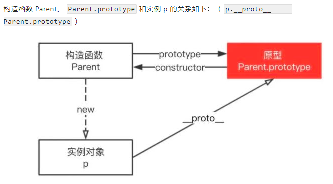

# 2. js基础知识点
---
# 2.1 JS函数+数组
## 1.闭包是什么？闭包的作用？闭包的使用场景？
    函数+环境=闭包；
    闭包的作用是封装数据和暂存数据；
    闭包的使用场景：（1）封装私有变量；（2）模仿块级作用域；（3）实现JS模块
## 2.js执行上下文栈和作用域链？
    执行上下文栈：就是当前Javascript代码被解析和执行所在环境，js执行上下文栈可以认为是一个存储函数调用的栈结构，遵循先进后出的原则。
    Javascript执行在单线程上，所有的代码都是排队执行的；一开始浏览器执行全局的代码的时候，首先创建全局的执行上下文栈，压入执行栈的顶部；
    每当进入一个函数的执行就会创建一个函数执行上下文，并把它压入栈顶。当前函数执行完后，当前函数的执行上下文出栈，等待垃圾回收。
    浏览器的js执行引擎总是访问栈顶的执行上下文。
    全局上下文只有唯一一个，他在浏览器关闭的时候出栈。
    
    作用域链：无论是从左开始的还是从右开始的查询，都会在当前的作用域开始查找，如果没有找到，就会向上一级的作用域中继续查找目标标识符，每次上升一个作用域，
    一直到全局作用域为止。
## 3.代码练习(关于数组的练习)
    3.1操作数组，返回一个新数组，新数组中只包含正数。
    function f1(arr) {
       var arr2=[];
        for(var i=0;i<arr.length;i++){
            if((typeof arr[i] == 'number') && (arr[i] > 0)){//巧妙之处,用typeof判断数据类型
                arr2.push(arr[i]);
            }
        }
        return arr2;
    }
    var arr = [3,-1,2,true]
    console.log(f1(arr));//输出[3,2]
    --------------------------------------------------------------
    3.2实现数据按照姓名、年纪、任意字段排序。
    function f1(filed) {
      return function(user1,user2){
          if(user1[filed] > user2[filed]){
              return 1;
          }else if(user1[filed] < user2[filed]){
              return -1;
          }else {
              return 0;
          }
      }
    }
    var user = [
       {name:"John",age:20,company:"baidu"},
       {name:"Pete",age:18,company:"alibab"},
       {name:"Ann",age:19,company:"tecent"},
    ]
    // console.log(user.sort(f1("company")));
    console.log(user.sort(f1("age")));
    // console.log(user.sort(f1("name")));
    ------------------------------------------------------------
    3.3用splice函数分别实现push、pop、shift、unshift方法
       function push1(arr,value) {
            arr.splice(arr.length,0,value);//从第length-1位开始删除0个元素，插入value
            return arr;
       }
       function pop1(arr) {
            arr.splice(arr.length-1,1);//从第length-1位开始删除1个元素
           return arr;
       }
       function shift1(arr) {
           arr.splice(0,1);//从第0位开始删除1个元素
           return arr;
       }
       function unshift1(arr,value) {
           arr.splice(0,0,value);//从第0位开始删除0个元素，插入value
           return arr;
       }
    
       var arr = [3,4,5];
       console.log(push1(arr,10));//[3,4,5,10]
       console.log(pop1(arr));//[3,4,5]
       console.log(shift1(arr));//[4,5]
       console.log(unshift1(arr,9));//[9,4,5]
     --------------------------------------------------------------------------------------
    3.4 数组去重
        function qc(arr){
           let arr2 = [];
           for(let i=0;i<arr.length;i++){
               if(arr2.indexOf(arr[i]) == -1){
                   arr2.push(arr[i]);
               }
           }
           return arr2;
        }
        console.log(qc([1,2,3,4,5,6,3,4,2]));
    3.5 使用原生js将一个多维数组拍平(重要)
       方法一：原始方法
       var array = [1,[2],[3,[4,[5]]]];
       function flat(){
           var flatArr = [];
           return function flatten(arr){
               for(var index=0;index<arr.length;index++){
                   Array.isArray(arr[index]) ? flatten(arr[index]) : flatArr.push(arr[index]);//判断array中的每一项是否是数组，如果是数组就递归，否则保存到新数组中
               }
               return flatArr;
           }
       }
       console.log(flat()(array));//[1，2，3，4，5]
       方法二：toString方法
        var array = [1,[2],[3,[4,[5]]]];
          function flat(){
              return array.toString().split(",").map(val => {
                  return parseInt(val);//注意：此处可以简写称 return +val;
              })
          }
          console.log(flat(array));
       
## 4.会改变原来数组元素的API?
    修改原数组的API有：
    sort() 顺序发生变化
    reverse() 顺序发生变化
    push() 数组变长
    unshift() 数组变长
    pop() 数组长度减少
    shift() 数组长度减少
    splice() 数组变长或者变少
## 5.for...of,for..in,forEach,map的区别？
    (1)for...of 循环，可以使用的范围包括数组，Set和Map结构，某些类似数组的对象，Gennerator对象，以及字符串。
    （2）for...in 循环遍历对象自身和继承的可枚举的属性，不能直接获取属性值，可以中断循环。
    （3）forEach(使用场景：只需要在数组上做迭代修改) 
        ①只能遍历数组，不能中断循环；
        ②为每个元素执行回调；
        ③没有返回值（或者返回值是undefined）
        eg:
        const a = [1,2,3]
        const double = a.forEach((num,index)=>{
            //执行与num,index相关的代码
        })  
        console.log(double);//undefined
    （4）map(使用场景：想得到一个结果，但是不想改变原来的数组，就用.map())
        ①遍历数组中的元素，不能中断循环；
        ②通过对每个元素调用函数，将每个元素“映射（map）”到一个新元素，从而创建一个新数组并返回。
        eg:
        const a = [1,2,3]
        var double = a.map(num =>{
            return a*2;
        })
        console.log(double);//[2,4,6]
## 6.for...of 遍历数组，for...in 遍历对象？
    function f1(arr) {
        for(var i of arr){
           console.log(Math.pow(i,2));//  这里是重点区分的地方（i）
        }
    }
    arr = [3,4,5];
    f1(arr);//9 16 25
    ------------------------------------------------------------------------------------------------------
     function f1(obj) {
        for(var key in obj){
            console.log(obj[key]);//  这里是重点区分的地方i（obj[key]）
        }
    }
    var company={
        name:"xiaowang",age:3,sex:"man"
    }
    f1(company);//xiaowang 3 man
## 7.如何取出一个数组中的最大值（ES5,ES6）?
    (1)ES5中
    Math.max.apply(null,[1,2,3,4,5]);//5    
    (2)ES6中
    Math.max(...[1,2,3,4,5])
    (3)reduce
    [1,2,3,4,5].reduce((index,currentValue)=>{return currentValue = index > currentValue ? index : currentValue})
---
# 2.2 面向对象编程
## 1.new的原理是什么？通过new创建的过程和通过字面量创建过程的区别？
    new的原理：
        （1）创建一个新对象；
        （2）设置this使他指向这个对象；
        （3）属性和方法被加入到this引用的对象中。并执行构造函数中的方法。
        （4）如果构造函数中没有返回其他对象，则this指向这个新对象。否则，则指向构造函数返回的对象。
    通过new创建对象和通过字面量创建对象的区别：
        （1）通过 字面量 创建的对象，如{}，不会调用Object构造函数，简介且性能好。
        （2）new Object() 创建对象，实际上是 方法调用。涉及到在proto原型链中遍历该方法，当找到该方法后，会产生方法调用的 堆栈信息；
            方法调用结束后，还要释放 堆栈。性能不如字面量的方式。
## 2.js创建对象的几种方式？
    （1）对象字面量 
        var obj = {};
    （2）构造函数
        var obj = new Object();
    （3）Object.create()
        var obj = Object.create(Object.prototype); 
## 3.如下代码，new 一个函数本质做了什么？
        function Model(msg){
            this.msg = msg;
        }
        var model = new Model(“hello”);
        (1)创建类的实例。把一个空对象的proto设置为Model.prototype;
        (2)初始化实例。函数Model被传入参数并被调用，关键字this设定为该实例。
        (3)返回实例，赋值给model.
## 4.JS原型是什么？如何理解JS中的原型链？
    （1）JS原型：在JavaScript中，每当定义一个对象（函数也是对象）的时候，对象中都会包含一些预定义的属性。
        其中，每个函数/对象都有一个prototype属性，这个属性指向函数的原型对象。使用原型对象的好处是，所有 实例共享
        他所包含的属性和方法。
    （2）原型链：原型链解决的主要是 继承问题。每个对象拥有一个原型对象，通过__proto__(读音dunder proto)指针指向其 
        原型对象，并从原型对象中继承属性和方法。同时，原型对象也可能拥有原型，这样一层一层的最终指向 null(Object.prototype.__proto__ 指向的就是null).
        这种关系被称为原型链（prototype chain）.
        通过原型链，一个对象可以继承其他对象属性和方法。

## 5.解释原型链中几个常见关键字。
### 5.1 有如下代码，解释Person、prototype、__proto__、p、constructor之间的关联：
    function Person(name){
        this.name  = name;
    }
    Person.prototype.sayName = function(){
        console.log("my name is :"+this.name);
    }
    var p = new Person("oli");
    p.sayName();
  - Person是对象，通过关键字 new ,实例化一个对象 p;
  - Person对象通过prototype 指向 Person原型对象;
  - p 通过__proto__指向 Person原型对象，继承他的属性和方法;
  - Person原型对象 通过 constructor 指向Person
### 5.2 有如下代码，代码中并未添加toString方法，这个是从那里来的？画出原型链图进行解释：
    function Person(){}
    var p = new Person()
    p.toString();
   - （1）去 p 本身去查找，看是否有toString()方法；
   - （2）没有找到，向上再查找一层，查找p.__proto__（即Person的原型对象中）,看是否有toString()
   - （3）没有找到继续往上查找，p__proto__.__proto__，直到返回null结束查找。
### 5.3 以下两种写法有什么区别？
        //方法一
        function Person(name,age) {
            this.name = name;
            this.age = age;
            this.printName = function () {
                console.log(this.name);
            }
        }
        var p1 = new Person("lili",2);
        //方法二
        function Person(name,age) {
            this.name = name;
            this.age = age;
        }
        Person.prototype.printName = function () {
            console.log(this.name);
        }
        var p2 = new Person('liuliu',3);  
   - （1）第一种写法，把printName()方法放在构造函数中，在每次创建Perple实例的时候，都会给新对象也增加printName()方法。
        如果new多个对象的时候，都会重复实例化printName()方法多次，浪费资源空间；
   - （2）第二种写法，把printName()方法放在Person.prototype中，在每次new Person()的时候，对象中会都拥有属性，也可以共用原型上的printName()方法，不管new多少个对象，都会共享这一个
        printName()方法，不会增加负担。
## 6.实现继承
### 6.1原型继承
    function Person(name,sex){
        this.name = name;
        this.sex = sex;
    }
    Person.prototype.getName = function () {
        console.log(this.name);
    }
    function Male(name,sex,age) {
        Person.call(this,name,sex);
        this.age = age;
    }
    Male.prototype = Object.create(Person.prototype);
    Male.prototype.getAge = function () {
        console.log(this.age);
    }
    var catcher = new Male('lili','man',2);
    catcher.getName();
---
---
# 2.3 JS提供的对象
## 1.正则表达式
    \w ,匹配数字，字母，下划线，相当于[a-zA-Z_0-9];
    \s,匹配空白字符;
    \d,匹配数字，相当于[0-9];
    ^,表示开始；
    $,表示结束；
    *,表示匹配0次或者多次； 等价于{0，}
    +，表示匹配1次或者多次； 等价于{1，}
    ？，表示匹配0次或者1次； 等价于{0，1}
    x{3},表示xxx
    /i,忽略大小写
    /g,全文查找
   
    .,表示除了回车换行符之外的所有字符；（记住）
    ^,在[]中的意思是排除。例如[^abc]表示匹配非abc之外的任意一个字符。
   
    几种常用的匹配规则：
       （1）判断输入的是否是一个手机号码
       var reg = /^1[3578]\d{9}$/g;
       reg.test(17324847731);//true
       （2）判断用户输入的是否是邮箱
       var reg = /^[\w | -]+@\w+.com$/g;
       reg.test(dhu@emile.com);//true
       （3）判断用户输入的是否是合法的用户名,长度只能在6-20位
       var reg = /^\w{6,20}$/g;
       reg.text("ping_123");//true
       （4）去掉开始和结尾的空白
       var reg = /^\s+ | \s+$/g
       str.replace(str);
## 2.JSON数据格式
    json数据格式应该遵循的规则：
    （1）复合类型的值：字符串（必须使用 双引号 ），数值（必须以10进制表示），布尔值，null(不能使用undefined,NaN,Infinity)
    （2）简单类型的值：数组，对象（不能是函数，正则表达式对象，日期对象）；
    （3）对象的键名必须放在 双引号 里面；
    （4）数组或者对象最后一个成员的后面不能加 逗号 。
    
    XML和JSON的区别：
    （1）数据体积方面：JSON相对于XML来讲，数据的体积更小，传递速度更快；
    （2）数据交互方面：JSON与JavaScript交互更加方便，更容易解析处理，更好的交互；
    （3）数据描述方面：JSON的数据描述没有XMLh好；
    （4）传输速度方面：JSON的速度要远远快于XML;
## 3.深拷贝和浅拷贝的区别？如何实现深拷贝和浅拷贝？
    浅拷贝：只拷贝指向某个对象的指针，而不复制对象本身，新旧对象还是共享同一块内存，浅拷贝只复制对象的第一层属性；
    深拷贝：回新创建一个一摸一样的对象，新对象和原对象不会共享同一块内存，修改新对象元对象不会改变。对对象的属性进行递归复制。
    
        //浅拷贝：通过简单的赋值实现
        function simpleClone(initalObj){
            var obj = {};
            for(var i in initalObj){
                obj[i] = initalObj[i];
            }
            return obj;
        }
        var obj = {
            a:"hehe",
            b:{
                a:'123',
                b:123
            },
            c:[1,2,3],
            d:function(){
                console.log("hi");
            }
        }
    
        var cloneObj = simpleClone(obj);
        console.log(cloneObj.b);//{a: "123", b: 123}
    
        cloneObj.c=[147,258,369];
        console.log(obj.c);//[1, 2, 3]
        console.log(cloneObj.c);//[147, 258, 369]
     
         //深拷贝，直接使用 var newObj = Object.create(oldObj);
         function deepClone(initObj,finalObj){
             var obj = finalObj || {};
             for(var key in initObj){
                 //避免相互引用对象导致死循环
                 var prop = initObj[key];
                 if(prop === obj){
                     continue;
                 }
                 if(typeof prop === 'object'){
                     obj[key] = (prop.constructor === Array) ? [] :Object.create(prop);
                 }else{
                     obj[key] = prop;
                 }
             }
             return obj;
         }
     
         var initObj = {
             a:"hehe",
             b:{
                 a:'123',
                 b:123
             },
             c:[1,2,3],
             d:function(){
                 console.log("hi");
             }
         }
         var finalObj={};
         deepClone(initObj,finalObj);
         console.log(finalObj.d);//f(){console.log("hi");}
        