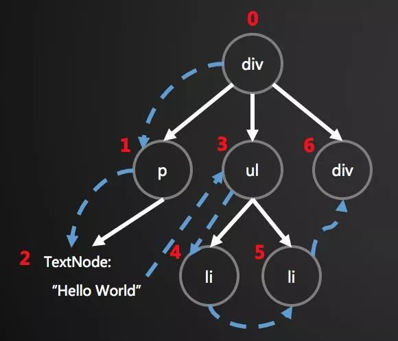

# 浏览器提供的对象BOM,DOM,定时器

--- 
## 1.iframe有什么缺点？
    (1)iframe会阻止主页面的onlade事件；
    (2)搜索引擎的检索程序无法解读这种页面，不利于SEO;
    (3)iframe和主页面共享连接池，而浏览器对相同域的连接有限制，所以会影响页面的并行加载；
## 2.什么是虚拟DOM(Virtual DOM)?为什么要使用虚拟DOM?
    Virtual DOM的概念有很多解释，分别是，一个对象，两个前提，三个步骤。
    （1）一个对象，指的是Virtual DOM是一个基本的Javascript对象，也是整个虚拟DOM树的基本。
    （2）两个前提，分别是Javascript很快和直接操作DOM很慢。
        V8引擎的出现，让Javascript可以高效的运行，在性能上有了极大的提高；
        直接操作DOM的低效和Javascript的高效相比，为虚拟DOM的产生提供了大前提；
    （3）三个步骤，指的是Virtual DOM的三个重要步骤，分别是：生成Virtual DOM树、对比两个棵树的差异、更新视图
        ①生成Virtual DOM树
            DOM是前端工程师最常接触的内容之一，一个DOM节点包含很多的内容，但是抽象出一个DOM节点却只需要三部分：
            节点类型，节点属性，子节点。所以围绕这三个部分，我们可以使用Javascript简单实现一棵DOM树，然后给节点
            实现渲染方法，就可以实现虚拟节点到真实DOM的转换。

~~~
    ②对比两棵树的差异
    比较两棵树的差异是Virtual DOM的核心部分。这也是我们常说的Virtual DOM的diff算法。在比较过程中我们只比较同级的节点
    非同级的节点不在我们的比较范围内，这样既满足我们的需求，又可以简化算法。
~~~      

~~~
    比较“树”的差异首先是要对树进行遍历，常用的有两种遍历算法：深度优先和广度优先，一般diff算法中采用的是深度优先。
    对新旧两棵树进行深度优先遍历，这样每一个节点都会有一个唯一的标记。在遍历的时候，每遍历到一个节点就把该节点和新的树
    的同一个位置的节点进行比较，如果有差异的话就利率到一个对象中。
    
    例如：上面的div有差异，当前标记是0，那么：
    pathches[0] = [{difference},{difference},...].
    同理p是pathches[1],ul是pathches[3]，以此类推。这样便利结束后，就可以获得一个完整的差异对象。

    这个差异对象中记录了有变化的节点，每一个发生改变的内容不相同，但是是有迹可循的，常见的差异包括以下四种：
    （1）替换节点；
    （2）增加/删除节点
    （3）修改节点属性
    （4）改变文本内容
~~~

~~~
    ③更新视图
    在第二步得到整棵树的差异之后，就可以根据这些差异的不同类型，对DOM进行针对性的更新。
    与上述四种类型相对赢得试图更新的具体方法如下：
    （1）replaceChild()
    （2）appendChild()/removeChild
    （3）setAttribute()/removeAttribute()
    （4）textContent
~~~
## 3.offsetWidth/offsetHeight,clientWidth/clientHeight,scrollWidth/scrollHeight之间的区别？
    offsetWidth/offsetHeight = content + border + padding;
    clientWidth/clientHeigh = content + border + 滚动条;
    scrollWidth/scrollHeight = content + padding + 溢出内容的尺寸。
## 4.attribute和property的区别？
    attribute:是DOM元素在文档中作为HTML标签的属性；
    property:是DOM元素在JS中作为对象的属性。    
## 5.代码补全：鼠标放在li元素上，会在div中显示当前li元素的data-img图片
    <ul class="ct">
        <li data-img = 'images/1.jpg'>鼠标方式查看图片1</li>
        <li data-img = 'images/2.jpg'>鼠标方式查看图片2</li>
        <li data-img = 'images/3.jpg'>鼠标方式查看图片3</li>
    </ul>
    

    
       
## 6.setTimeout、setInterval、requestAnimationFrame各有什么特点？
    setTimeout 和  setInterval都不精确。他们的内在运行机制决定了时间间隔参数实际上 只是 指定了把动画代码添加到
    浏览器UI线程队列中 等待执行的时间。如果队列前面已经加入了其它任务，那么动画代码就要等前面的任务执行完成后再执行。
    注意：setTimeout(function(){},),第二个参数表示最少执行时间，并非是确切时间。
    requestAnimationFrame采用系统时间间隔，保持最佳绘制效率，不会因为时间间隔过短，造成过渡绘制，增加开销；
    也不会因为时间间隔过长，使动画卡顿不流畅，让各种网页东华效果额能够有一个统一的刷新机制，从而节省系统资源，提高系统性能，
    改善视觉效果。
## 7. 单线程、任务队列、同步和异步？
    （1）单线程：Javascript是浏览器用来和用户进行交互、进行DOM操作的，这也使得他必须是单线程的。
        所谓的单线程就是只有一条现，一步一步的执行。
    （2）任务队列：
        任务（消息）队列是一个先进先出的队列，它里面存放了各种任务（消息）。
        在JavaScript中任务有两种：
        1.同步任务：各个人物按照文档定义的顺序一一进入“执行栈”中，当前一个任务执行完毕后，才会执行下一个任务；
        2.异步任务： 各个任务进入“任务队列”中，只有在当前的所有同步任务执行完毕后，才会将队列中的任务“出队”执行。
        注意：当线程中没有执行任何同步代码的前提下才会执行异步代码。
    （3）同步的异步的区别：
        同步：浏览器访问服务器请求，用户看得到页面刷新，重新发请求。
            等请求完成，页面刷新，新内容出现，用户看到新内容，进行下一步操作。
        异步：浏览器访问服务器请求，用户正常操作，浏览器后端进行请求。
            等请求完成，页面不刷新，新内容也会出现，用户看到新内容。
## 8. DOM事件模型是什么？
    DOM事件模型主要分三种：
    （1）事件冒泡：元素先监听到这个事件，然后往外传播；
    （2）事件捕获：Document最先建通到这个事件；
    （3）DOM事件流：先捕获，再冒泡。允许在某些地方监听事件，假设在某个元素两阶段都绑定在一个事件监听器，看你是决定在左边捕获阶段监听；
        还是在右边捕获阶段监听。哪一边响应，哪一边就被触发。即可以在任意一阶段，任意时机监听事件。
## 9.解释DOM2事件传播机制？
    DOM作为事件处理的一个基本标准，DOM2事件为DOM事件的升级；
    DOM2事件定义用于处理指定和删除事件处理程序的操作：
        addEventListener()
        removeEventListener()
    所有DOM节点都包含这两个方法，并且他们都接收三个参数：
        （1）事件类型（如：click,mouseover,mouseout等）
        （2）事件处理方法（一般是function（）{}）
        （3）布尔参数（true/false）true表示在捕获阶段处理调用事件处理程序；false表示在事件冒泡阶段处理
## 10. 事件传播机制、阻止传播、取消默认事件、 事件代理？
    （1）事件传播机制：主要分三种
    1.事件冒泡：事件开始由最具体的元素接收，然后主机向上传播到较为不具体的元素（从小到大）；
    2.事件捕获：不太具体的节点更早的接收事件，而最具体的元素最后接收事件，和时间冒泡相反（从大到小）；
    3.DOM事件流：DOM2级事件规定事件流包括三个阶段——>事件捕获阶段、目标阶段、事件冒泡阶段。
        首先发生的是事件捕获，为截取事件提供机会；
        然后是实际目标接收事件；
        最后是冒泡阶段（标准浏览器仙子啊都使用DOM事件流，IE不支持事件流，只支持事件冒泡）
    （2）阻止传播
         stopPropagation();取消事件进一步捕获或者冒泡
    （3）取消默认事件
        preventDefault();取消事件默认行为
    （4）事件代理（事件委托）
        通过事件冒泡（或者事件捕获）给父元素添加事件监听，e.target指向触发事件的元素。
        好处：
            ①内存占用减少，因为只需要一个父元素的事件处理程序，而不必为每个后代都添加事件处理程序；
            ②无需从已删除的元素中解绑处理程序，也无需将处理程序绑定到新元素上。
## 11.window.onlod 和documnet.onDOMContentLoaded有什么区别？
    //当页面所有资源加载完成，触发(涉及到所有资源，所以触发时机较晚)
    window.onload = function(){
        console.log("window loaded")
    }
    //DOM结构解析完成后触发(并不是页面上资源加载完成，而是DOM结构渲染完成)
    window.addEventListener = ("DOMContentLoaded",function(){
        console.log("DOMContentLoaded")
     })
                     
            
            